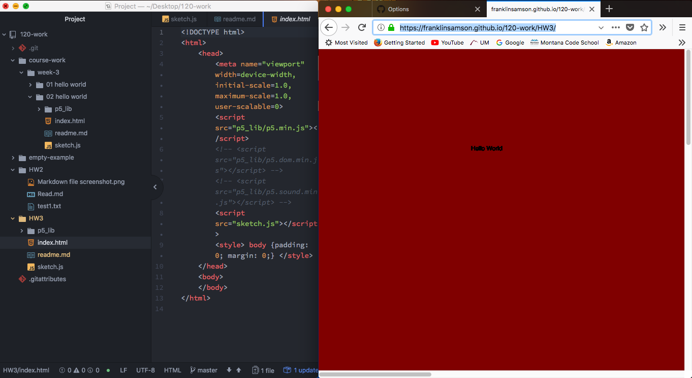

Frankln Samson, 50

["Hello
World"](https://franklinsamson.github.io/120-work/HW3/)

## Final sketch

This is what my final sketch looks like.

# HW-3 Response

I found this week's assignment very intesting. Finally working with p5 has really got my juices flowing. Like I mentioned before I've done a little bit over coding in the past so this is a quite refresher. I learned once again how to create a canvas as well as change it's background.

In order to complete this assinment I followed closely along with all the tutorial videos that were provided and read through the course infomation thoroughly.

I didn't have any issues or problems. I basically followed along with the tutorial videos which was really helpful in completing HW-3. I did not post anything on the issue tracker because I did not have any major problems.

Nothing in particular that I want to discuss. I've learned quite a bit these last few weeks and enjoying everything about this class so far.

Nothing at all. I'm sorry to say that but I'm sure if I knew the answer to the questions they are asking I wouldn't hesitate to respond.
